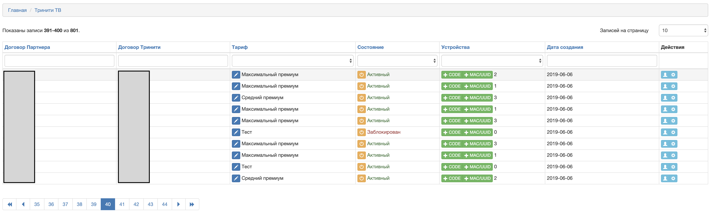

Yii2-module-trinitytv
---------------------
Yii2 module for Trinity TV API


Installation
------------

The preferred way to install this extension is through [composer](http://getcomposer.org/download/).

Either run

```
php composer.phar require --prefer-dist mackiavelly/yii2-module-trinitytv "*"
```

or add

```
"mackiavelly/yii2-module-trinitytv": "*"
```

to the require section of your `composer.json` file.

Config
------

```
Yii::$app->params['trinitytv'] = [
	'partnerId' => 'partnerId',
	'salt'      => 'salt',
	'serviceId' => [
		20 => 'Тест',
		30 => 'Минимальный',
		40 => 'Средний премиум',
		50 => 'Максимальный премиум',
	],
];
```

```
'modules' => [
	'trinitytv' => [
		'class' => mackiavelly\modules\trinitytv\TrinitytvModule::class,
	],
],
```

